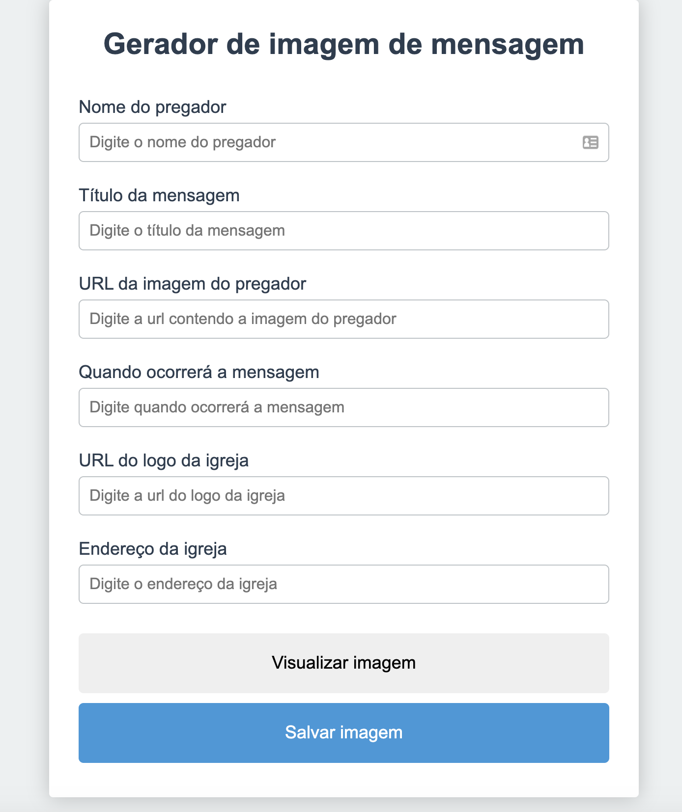

# Gerador de Imagens - Pregação
Para ajudar a todos que precisam criar imagens de pregações em sua igreja, está aí o projeto.

Ao acessá-lo você consegue gerar uma imagem como a de baixo:


Para isso, você preenche os seguintes campos:
- Nome do pregador
- Título da mensagem(opcional)
- Data de quando ocorrerá a pregação
- URL com a imagem do pastor
- URL com o logo da sua igreja
- Endereço da sua igreja




---

## Sumário

- [Requisitos](#requisitos)
- [Instalação](#instalação)
- [Documentação](#documentação)

## Requisitos

- Node v12.18.2
- Npm v6.14.8

## Instalação

Execute o seguindo comando no seu terminal:

```bash
npm install
```

## Uso

Execute o seguindo comando no seu terminal:

```bash
npm start
```

## Gerar build

Execute o seguindo comando no seu terminal:

```bash
npm run build
```